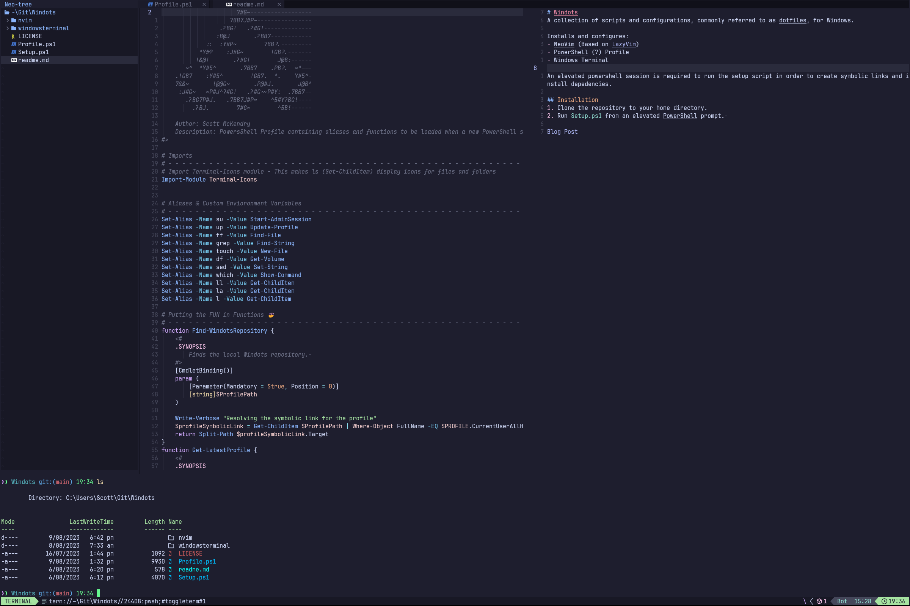
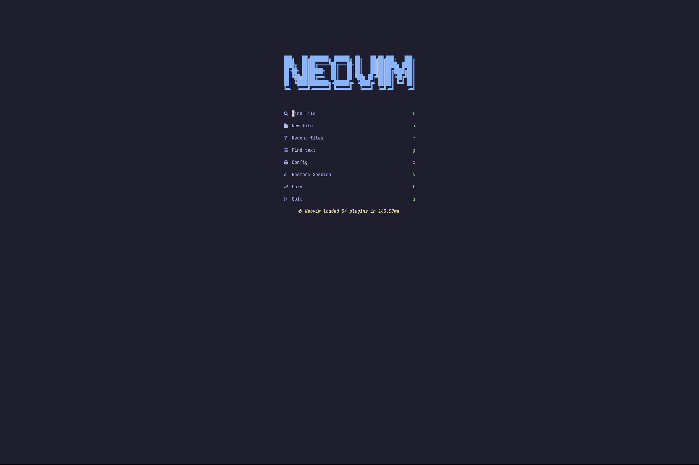

# Windots
A collection of scripts and configurations, commonly referred to as dotfiles, for Windows.

Installs and configures:
- NeoVim (Based on [LazyVim](https://github.com/LazyVim/LazyVim))
- PowerShell (7) Profile
- Windows Terminal

An elevated powershell session is required to run the setup script in order to create symbolic links and install depedencies.

## Pre-requisites
- [PowerShell 7](https://learn.microsoft.com/en-us/powershell/scripting/install/installing-powershell-on-windows?view=powershell-7.3#install-powershell-using-winget-recommended)
- [Git](https://winget.run/pkg/Git/Git)

## Installation
1. Clone the repository to your preferrred location.
2. Run `Setup.ps1` from an elevated PowerShell prompt. 

## Screenshots:

 

**[Blog Post](https://scottmckendry.tech/the-ultimate-powershell-profile/)**
